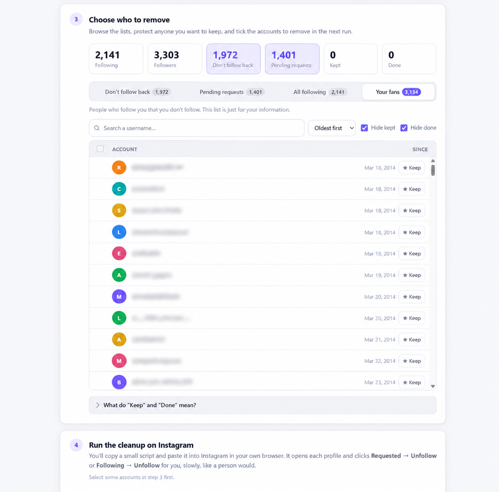
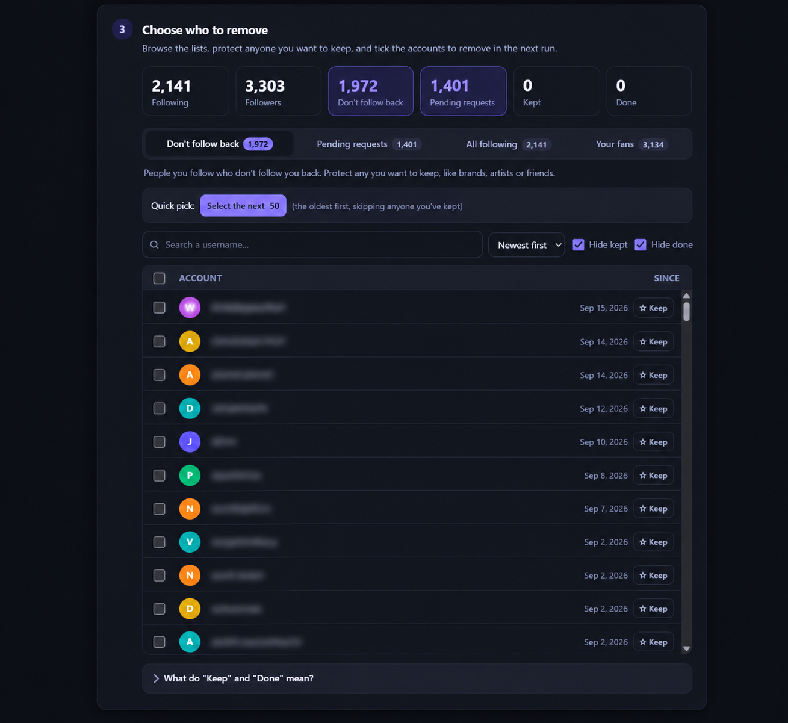

# IG Cleanup

**Clean up your Instagram following list and cancel old follow requests, without giving your password to anyone.**

**[Open the tool](https://mahmooodsaeed.github.io/IG-Cleanup-Tool/)** · Free · Open source · Runs entirely in your browser

IG Cleanup is a single web page. You open Instagram's official data export in it, choose who to remove, and it gives you a small script that unfollows those accounts slowly in your own logged-in Instagram tab. There's no server, no login and no third-party app.



## What it does

- **Finds who doesn't follow you back.** Compares your following and followers lists.
- **Finds old follow requests.** Lists every request you sent to a private account that was never accepted, even from years ago.
- **Unfollows or cancels in safe batches.** Opens each profile and clicks **Requested → Unfollow** or **Following → Unfollow**, with random pauses so it behaves like a person.
- **Remembers your progress.** Mark accounts to *Keep* (never removed) or *Done*. Everything is saved in your browser, so you can do a few batches a day.
- **Private by design.** The browser blocks the page from connecting to the internet, and it never asks for your password.

## How to use it

### Option 1: Use the online version (easiest)

Open **https://mahmooodsaeed.github.io/IG-Cleanup-Tool/** and follow the steps on the page.

Your files are still read only on your own computer. The page is just delivered from GitHub, and it can't send anything back.

### Option 2: Download it and open it from your computer

1. Click the green **Code** button at the top of this page → **Download ZIP**.
2. Unzip it, open the **`Instagram-Cleanup-Tool-main`** folder and double-click **`index.html`**. It opens in your browser.
3. Follow the steps on the page.

It works without an internet connection.

### The steps, in short

| Step | What you do |
|---|---|
| **1. Get your data** | Instagram → Settings → Accounts Center → Your information and permissions → **Download your information** → *Some of your information* → **Followers and following**. Set **Date range: All time** and **Format: JSON**. |
| **2. Open it** | Drop the ZIP file Instagram emails you onto the page. You don't need to unzip it. |
| **3. Choose** | Browse "Don't follow back" or "Pending requests", click **Keep** on anyone you want to keep, then click **Select the next 50**. |
| **4. Run** | Click **Copy cleanup script**. On instagram.com (desktop Chrome or Edge), open the Console (`Ctrl+Shift+J`, or `Cmd+Option+J` on Mac), paste, press Enter, then click **Start** in the box that appears. If Chrome warns about pasting, type `allow pasting` and press Enter first. |
| **5. Tick off** | Paste the finished usernames back into the page so it knows where you left off. |

> **"All time" and "JSON" matter.** With a shorter date range, older followers are missing and the tool would wrongly say they don't follow you back. The HTML format can't be read.

The page explains each step in detail, with help for common problems.



## Staying safe

Instagram limits how fast anyone can unfollow. Going too fast gets you a temporary **"Try Again Later"** block.

- Use the **Balanced** speed (20–40 seconds between accounts) or **Careful** speed.
- Do **40–60 accounts per run** and **2–3 runs a day**.
- The script stops by itself if Instagram shows a warning. If that happens, stop for the day.
- Look through your selection before you run it. Removing someone can't be undone by the tool.

> ⚠️ Automating actions is against Instagram's Terms of Use. This tool keeps things slow and human-like, but use it at your own risk. For zero risk, use the lists to unfollow by hand.

## Privacy

- The whole tool is one file, [`index.html`](index.html). You can read every line.
- A Content Security Policy (`default-src 'none'`) makes the browser block **every** network request from the page, so your export can't be uploaded even by accident.
- The cleanup script runs inside your own Instagram tab, using the login you already have. It never asks for or reads your password, and it doesn't send data anywhere.
- Your lists and Keep/Done marks are saved in your browser's local storage, on your computer only. Use **Clear loaded lists** to remove them.

## Try it without your own data

Click **"Try it with made-up sample data"** in step 2, or load the files in [`sample-data/`](sample-data/). All names in them are made up. The sample data never touches your saved lists or marks.

---

## How it's built

IG Cleanup is a static, local-first web app: one HTML file with vanilla JavaScript and CSS. It has no framework, no build step, no backend and no runtime dependencies.

### Highlights

- **Privacy enforced by the browser.** It's not just a promise: `default-src 'none'` blocks all network access from the page.
- **ZIP reading in the browser without libraries.** A small reader walks the ZIP's central directory and inflates files with the native `DecompressionStream` API.
- **Tolerant parsing.** It handles several Instagram export formats, follower lists split across files, and renamed downloads. It skips unrelated export files such as followed hashtags and received requests.
- **UI-driven automation.** The generated script opens each profile in a helper window and clicks Instagram's own buttons. It doesn't call Instagram's internal API.
- **Defensive stop conditions.** It stops on Instagram's "Try Again Later" message, confirms each unfollow before counting it, and stops after repeated failures.
- **Resumable progress.** Lists, Keep/Done marks and settings are kept in `localStorage`.
- **End-to-end tests** with Playwright against a mock Instagram site. They never touch the real one.
- **Responsive, light/dark, keyboard-accessible** interface.

### How data flows

```text
 Instagram export (ZIP / JSON)
          │  read locally, never uploaded
          ▼
 Parser ── detects the export format, ignores unrelated files
          │
          ▼
 Normalised lists: followers · following · pending requests
          │
          ▼
 Comparison ── "don't follow back", "pending", "fans"
          │
          ▼
 You review, Keep some, select a batch
          │
          ▼
 Script generator ── copies a readable script to your clipboard
          │  you paste it yourself
          ▼
 Your Instagram tab ── helper window clicks Unfollow, one account at a time
```

### Key design decisions

**Local-first instead of server-side processing.** Instagram exports are personal data. Processing them in the browser means there's nothing to upload, store or secure on a server. The Content Security Policy makes that a guarantee.

**Clicking buttons instead of calling Instagram's API.** An early version called Instagram's internal web API directly. Looking up each account's ID was quickly rate-limited (HTTP 429). Driving the normal profile page avoids those lookups and does exactly what a person would do, which also makes the behaviour easy to understand and check.

**Verify every step.** The script confirms it's looking at the exact profile it opened, which matters when similar usernames like `ab` and `abc` come one after another. It re-checks an account that looks already unfollowed, in case the page was still loading. It only counts an account as done once the button has changed to **Follow**.

**Normalise input before any logic runs.** Instagram has changed its export structure several times. Every format is converted into the same simple `username → date` lists first, so supporting a new format only touches the parser.

**Mock external systems in tests.** Testing against the real Instagram would depend on logins, rate limits and UI changes, and would unfollow real people. The tests serve a controlled imitation of Instagram's profile pages instead.

### Supported export formats

- the classic format (`string_list_data` with `value` / `href`)
- the newer format where the username is in `title`
- the 2026 format with `label_values` (`Username`, `URL`)
- ZIP files, unzipped folders or individual JSON files, including renamed copies like `following (1).json`
- large accounts whose followers are split into `followers_1.json`, `followers_2.json`, …

Instagram can change its export without notice. If yours doesn't load, please [open an issue](../../issues) and include the message the page shows. **Don't upload your actual export file.**

### Tests

The end-to-end test (Node.js 20.15 or newer):

- loads the sample export and checks the counts
- selects a batch, copies the script, and runs it on a mock Instagram page that has "Requested", "Following" and already-unfollowed profiles
- pastes the results back and checks they're marked done
- checks that sample data never overwrites real saved marks
- builds a realistic export ZIP (split follower files in any order, plus unrelated files) and checks it's read correctly
- fails if the page makes any network request

```bash
npm install
npx playwright install chromium
npm test
```

### Project structure

```text
Instagram-Cleanup-Tool/
├── index.html          the whole app: UI, parser, script generator
├── sample-data/        made-up export files for trying and testing
├── tests/e2e.mjs       Playwright end-to-end test with a mock Instagram
├── Light.png, Dark.png screenshots
├── package.json        test setup only (the app itself has no dependencies)
└── LICENSE
```

## Limitations

- Instagram can change its export format or website at any time, which may break parsing or the button clicking until the tool is updated.
- The script looks for Instagram's English button labels. Switch Instagram to English while running it.
- Step 4 needs a desktop browser. Everything else also works on a phone.
- The lists are a snapshot from the day of your export. Download a fresh export to see current numbers.

## License

[MIT](LICENSE). Free to use, change and share.

*IG Cleanup is an independent project. It is not affiliated with, endorsed by or sponsored by Instagram or Meta. "Instagram" is a trademark of Meta Platforms, Inc.*
